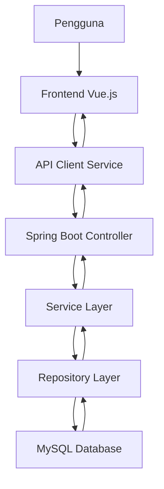
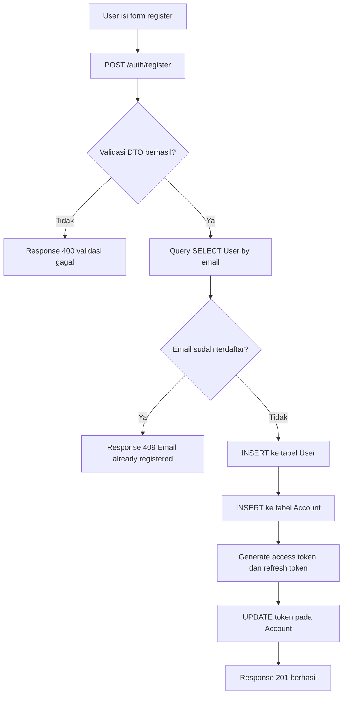
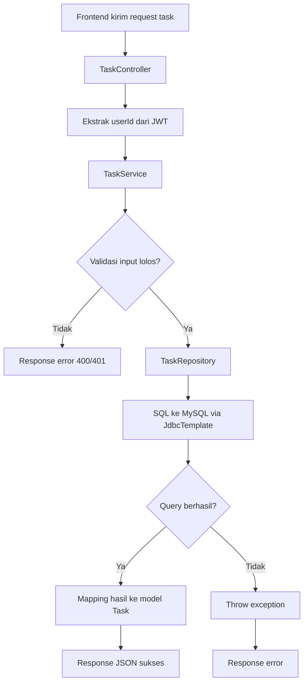
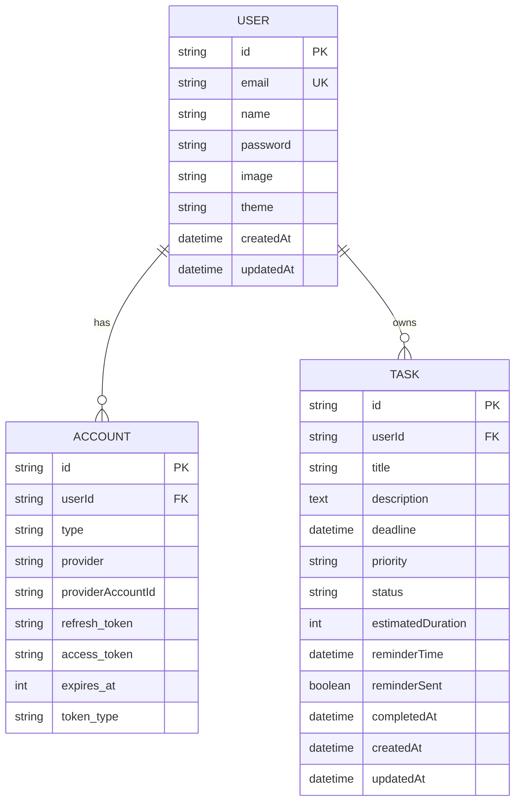

# LAPORAN TUGAS BESAR PEMROGRAMAN BASIS DATA
# SMART TASK PLANNER: IMPLEMENTASI MANAJEMEN TUGAS BERBASIS PRIORITAS DENGAN INTEGRASI DATABASE RELASIONAL

**Tim Pengusul:**  
**konnn**
**FAKULTAS TEKNIK DAN INFORMATIKA**  
**UNIVERSITAS DIAN NUSANTARA**  
**Mei 2026**

---

## KATA PENGANTAR

Rasa syukur yang mendalam penulis panjatkan ke hadirat Tuhan Yang Maha Esa, karena atas limpahan rahmat dan penyertaan-Nya, laporan Tugas Besar dengan judul **Smart Task Planner** ini dapat rampung dengan baik. Penyusunan laporan ini ditujukan untuk memenuhi komponen penilaian Ujian Akhir Semester (UAS) untuk mata kuliah Pemrograman Basis Data di Program Studi Teknik Informatika.

Selama proses pengerjaan proyek hingga laporan ini selesai, penulis banyak menerima bantuan, bimbingan, serta dorongan semangat dari berbagai pihak. Oleh sebab itu, dengan segala kerendahan hati penulis ingin menyampaikan apresiasi dan terima kasih yang tulus kepada:

1. Ibu Dea Andini Andriati S.Kom,. M.M.S.I selaku dosen pengampu mata kuliah, yang telah meluangkan waktu untuk memberikan arahan, ilmu, serta bimbingan yang sangat bernilai bagi penulis selama semester ini.
2. Rekan-rekan kelompok Bayu, Ichtiar, Najwa, dan Tania atas kerja sama yang produktif serta dedikasinya dalam merampungkan proyek ini bersama-sama.
3. Orang tua serta keluarga di rumah yang tiada hentinya memberikan dukungan doa, moral, maupun materi sehingga penulis dapat fokus belajar.
4. Rekan-rekan mahasiswa dan seluruh pihak yang tidak disebutkan satu per satu, yang telah membantu kelancaran penyusunan laporan ini dari awal hingga akhir.

Selain sebagai bentuk pertanggungjawaban akademik, laporan ini juga disusun untuk mendokumentasikan bagaimana konsep pemrograman basis data diterapkan pada aplikasi nyata, mulai dari perancangan tabel, koneksi JDBC ke MySQL, implementasi query CRUD, validasi input, keamanan dasar, hingga integrasi frontend dan backend. Dengan demikian, laporan ini tidak hanya berfungsi sebagai dokumen pelengkap tugas besar, tetapi juga sebagai catatan teknis atas proses pengembangan sistem yang telah dilakukan.

Penulis menyadari bahwa rancangan sistem maupun laporan ini masih jauh dari kata sempurna. Maka dari itu, kritik konstruktif serta saran yang membangun dari pembaca akan sangat penulis hargai demi perbaikan karya-karya selanjutnya. Semoga laporan Tugas Besar ini membawa manfaat nyata bagi perkembangan ilmu pengetahuan, khususnya di ranah Teknik Informatika.

Jakarta, 29 Mei 2026

Penulis

---

## ABSTRAK

Aplikasi pengelolaan tugas merupakan salah satu bentuk sistem informasi yang membutuhkan pengolahan data terstruktur, konsisten, dan aman. Pada tugas besar ini dikembangkan aplikasi **Smart Task Planner** berbasis web dengan arsitektur frontend-backend, di mana backend dibangun menggunakan Java Spring Boot dan terhubung ke MySQL melalui Java Database Connectivity (JDBC) dengan bantuan `JdbcTemplate`. Sistem dirancang untuk mendukung kebutuhan utama berupa autentikasi pengguna, pencatatan tugas, pembaruan status tugas, penghapusan data, serta penyajian statistik produktivitas harian dan mingguan.

Fokus utama laporan ini adalah implementasi aspek pemrograman basis data, meliputi desain tabel relasional, penggunaan query SQL manual, prepared statement untuk pencegahan SQL injection, validasi input sebelum operasi basis data, pengelolaan token autentikasi yang disimpan dalam tabel akun, serta alur CRUD dari lapisan controller, service, repository, hingga eksekusi query pada database. Selain itu, laporan ini juga meninjau integrasi frontend Vue.js yang mengonsumsi endpoint backend melalui pola request berbasis token Bearer dan mekanisme refresh token otomatis.

Hasil implementasi menunjukkan bahwa aplikasi telah memenuhi inti kebutuhan CRUD dan dokumentasi teknis dengan pendekatan basis data yang cukup jelas dan terukur. Query disusun secara eksplisit sehingga alur akses data mudah dianalisis, sementara validasi pada sisi controller dan service membantu mencegah data tidak valid masuk ke database. Meskipun demikian, beberapa kebutuhan seperti transaksi multi-operasi eksplisit, benchmark performa formal, dan penyesuaian penuh terhadap Oracle masih menjadi catatan pengembangan lanjutan.

**Kata kunci:** MySQL, JDBC, Spring Boot, Vue.js, CRUD, JWT, Pemrograman Basis Data.

---

## BAB I: PENDAHULUAN

### 1.1 Latar Belakang

Kebutuhan akan pengelolaan aktivitas yang terstruktur semakin meningkat, terutama bagi mahasiswa dan pekerja yang harus menangani banyak tugas dalam waktu yang terbatas. Pengelolaan tugas secara manual sering kali tidak mampu memberikan visibilitas terhadap prioritas, deadline, maupun progres pekerjaan. Kondisi ini dapat menyebabkan keterlambatan, penurunan produktivitas, dan kesulitan dalam evaluasi capaian harian maupun mingguan.

Dalam konteks pemrograman basis data, aplikasi manajemen tugas menjadi studi kasus yang relevan karena melibatkan operasi **Create, Read, Update, Delete (CRUD)**, autentikasi pengguna, relasi tabel, validasi data, dan pengambilan statistik dari data operasional. Oleh sebab itu, pengembangan aplikasi **Smart Task Planner** dipilih sebagai implementasi tugas besar karena dapat mempresentasikan aspek praktis pemrograman basis data secara cukup lengkap.

### 1.2 Rumusan Masalah

Rumusan masalah pada proyek ini adalah sebagai berikut:

1. Bagaimana merancang aplikasi manajemen tugas yang memanfaatkan basis data relasional sebagai pusat penyimpanan data pengguna dan tugas?
2. Bagaimana mengimplementasikan operasi CRUD yang aman menggunakan JDBC dan query SQL manual?
3. Bagaimana menerapkan validasi input, verifikasi data seperti email terdaftar, dan penanganan error agar integritas data tetap terjaga?
4. Bagaimana frontend dapat terintegrasi dengan backend melalui REST API untuk memanfaatkan data yang berasal dari database?
5. Sejauh mana implementasi aplikasi ini telah memenuhi kebutuhan tugas besar Pemrograman Basis Data?

### 1.3 Tujuan

Tujuan dari pengembangan dan penulisan laporan ini adalah:

1. Membangun aplikasi task planner yang memanfaatkan MySQL sebagai basis data relasional.
2. Mengimplementasikan operasi CRUD melalui Java Spring Boot dan JDBC.
3. Mendokumentasikan alur query, validasi, autentikasi, dan integrasi data secara teknis.
4. Menyajikan analisis kesesuaian antara implementasi aktual dengan kebutuhan tugas besar.
5. Menunjukkan bagaimana frontend Vue.js memanfaatkan endpoint backend untuk menampilkan dan memanipulasi data.

### 1.4 Manfaat

Manfaat dari proyek ini adalah:

1. Menjadi contoh implementasi pemrograman basis data pada aplikasi nyata.
2. Memberikan pemahaman mengenai alur data dari antarmuka pengguna ke database.
3. Menjadi dasar pengembangan sistem yang lebih kompleks, misalnya reminder, analitik, atau integrasi AI.
4. Menunjukkan praktik dasar keamanan data pada aplikasi berbasis web.

---

## BAB II: TINJAUAN PUSTAKA

### 2.1 Basis Data Relasional

Basis data relasional merupakan sistem penyimpanan data yang mengorganisasi data ke dalam tabel-tabel yang saling berhubungan melalui primary key dan foreign key. Model ini sesuai untuk aplikasi task planner karena data pengguna, akun autentikasi, dan tugas memiliki relasi yang jelas. Keunggulan model relasional terletak pada konsistensi data, kemampuan query, serta dukungan integritas referensial.

### 2.2 JDBC dan Spring JDBC

Java Database Connectivity (JDBC) adalah API standar Java untuk berkomunikasi dengan database. Dalam proyek ini, backend menggunakan pendekatan SQL manual melalui `JdbcTemplate`, sehingga pengembang dapat mengontrol langsung bentuk query yang dijalankan. Pendekatan ini sangat relevan untuk mata kuliah Pemrograman Basis Data karena mahasiswa dapat melihat dengan jelas query `SELECT`, `INSERT`, `UPDATE`, dan `DELETE` yang benar-benar dieksekusi.

### 2.3 REST API

REST API digunakan sebagai jembatan antara frontend dan backend. Frontend tidak mengakses database secara langsung, melainkan mengirim request HTTP ke backend. Backend kemudian melakukan validasi, membangun objek bisnis, mengeksekusi query, dan mengembalikan hasil dalam format JSON. Dengan pola ini, logika basis data tetap terpusat dan lebih aman.

### 2.4 Autentikasi JWT

JSON Web Token (JWT) digunakan untuk memastikan hanya pengguna yang sah yang dapat mengakses data privat. Setelah login berhasil, backend menghasilkan access token dan refresh token. Access token dipakai pada setiap request privat melalui header `Authorization`, sedangkan refresh token digunakan untuk memperoleh token baru ketika access token tidak valid lagi.

### 2.5 Validasi dan Error Handling

Validasi diperlukan agar data yang masuk ke database tetap sesuai aturan bisnis. Pada proyek ini terdapat kombinasi validasi berbasis anotasi `@Valid` pada DTO autentikasi dan validasi manual pada service/controller untuk data task. Error handling global juga disediakan agar respons kesalahan ke client lebih konsisten.

---

## BAB III: METODE PENELITIAN DAN PERANCANGAN SISTEM

### 3.1 Metode Pengembangan

Metode yang digunakan adalah implementasi bertahap berbasis kebutuhan fitur utama. Tahapannya meliputi:

1. Analisis kebutuhan dari dokumen tugas besar.
2. Identifikasi entitas dan relasi data.
3. Penyusunan backend API berbasis Spring Boot.
4. Implementasi repository menggunakan `JdbcTemplate`.
5. Integrasi frontend Vue.js dengan backend.
6. Pengujian alur autentikasi, CRUD task, dan statistik.
7. Penyusunan dokumentasi teknis dalam bentuk laporan.

### 3.2 Arsitektur Sistem

Arsitektur sistem dibagi menjadi tiga lapisan utama:

1. **Frontend Layer**: Vue.js menangani interaksi pengguna.
2. **Backend Layer**: Spring Boot menangani endpoint, logika bisnis, autentikasi, dan akses database.
3. **Database Layer**: MySQL menyimpan data `User`, `Account`, dan `Task`.



### 3.3 Diagram Alur Proses Registrasi



### 3.4 Diagram Alir CRUD Task



### 3.5 Entity Relationship Diagram (ERD)



### 3.6 Usulan DDL Berdasarkan Implementasi Aplikasi

Berikut adalah bentuk DDL yang disusun berdasarkan struktur data yang digunakan di backend:

```sql
CREATE TABLE User (
    id VARCHAR(64) PRIMARY KEY,
    email VARCHAR(191) NOT NULL UNIQUE,
    name VARCHAR(150) NOT NULL,
    password VARCHAR(255) NOT NULL,
    image TEXT NULL,
    theme VARCHAR(20) DEFAULT 'light',
    createdAt DATETIME NOT NULL,
    updatedAt DATETIME NOT NULL
);

CREATE TABLE Account (
    id VARCHAR(64) PRIMARY KEY,
    userId VARCHAR(64) NOT NULL,
    type VARCHAR(50),
    provider VARCHAR(50) NOT NULL,
    providerAccountId VARCHAR(191),
    refresh_token TEXT,
    access_token TEXT,
    expires_at INT,
    token_type VARCHAR(50),
    scope TEXT,
    id_token TEXT,
    session_state TEXT,
    CONSTRAINT fk_account_user FOREIGN KEY (userId) REFERENCES User(id)
);

CREATE TABLE Task (
    id VARCHAR(64) PRIMARY KEY,
    userId VARCHAR(64) NOT NULL,
    title VARCHAR(255) NOT NULL,
    description TEXT,
    deadline DATETIME NOT NULL,
    priority VARCHAR(20) NOT NULL,
    status VARCHAR(20) NOT NULL,
    estimatedDuration INT,
    reminderTime DATETIME NULL,
    reminderSent BOOLEAN DEFAULT FALSE,
    completedAt DATETIME NULL,
    createdAt DATETIME NOT NULL,
    updatedAt DATETIME NOT NULL,
    CONSTRAINT fk_task_user FOREIGN KEY (userId) REFERENCES User(id)
);

CREATE INDEX idx_task_user ON Task(userId);
CREATE INDEX idx_task_status ON Task(status);
CREATE INDEX idx_task_deadline ON Task(deadline);
CREATE INDEX idx_task_completedAt ON Task(completedAt);
```

Catatan: DDL di atas merupakan rekonstruksi teknis dari model dan query yang ditemukan pada kode backend. Jika digunakan untuk demo akhir, DDL dapat disesuaikan kembali dengan skema database aktual pada lingkungan pengembangan.

---

## BAB IV: HASIL IMPLEMENTASI DAN PEMBAHASAN

### 4.1 Gambaran Umum Implementasi

Aplikasi terdiri atas backend Java Spring Boot dan frontend Vue.js. Backend bertanggung jawab penuh terhadap autentikasi, validasi bisnis, dan akses basis data. Frontend berperan sebagai client yang mengirim request dan menampilkan hasil data dari backend.

Dari sisi mata kuliah Pemrograman Basis Data, bagian terpenting proyek ini adalah bahwa query ke database tidak disembunyikan oleh ORM penuh. Sebaliknya, query ditulis secara eksplisit pada repository, misalnya query pencarian user berdasarkan email, query insert task, query update status task, dan query agregasi statistik. Hal ini membuat proses pembelajaran terhadap SQL dan alur akses data menjadi lebih nyata.

### 4.2 Implementasi Koneksi Database

Konfigurasi koneksi database dikelola melalui properti Spring datasource. Dari hasil pemeriksaan file konfigurasi, backend menggunakan MySQL dengan driver `com.mysql.cj.jdbc.Driver` dan URL JDBC yang dapat diambil dari environment variable.

Contoh konfigurasi aktual:

```yaml
spring:
  datasource:
    url: ${SPRING_DATASOURCE_URL:jdbc:mysql://192.168.1.2:3307/taskplanner}
    username: ${SPRING_DATASOURCE_USERNAME:root}
    password: ${SPRING_DATASOURCE_PASSWORD:0202}
    driver-class-name: ${SPRING_DATASOURCE_DRIVER:com.mysql.cj.jdbc.Driver}
```

Pendekatan ini memiliki beberapa kelebihan:

1. Koneksi tidak di-hardcode langsung di source code Java.
2. Konfigurasi bisa diubah antar lingkungan tanpa mengedit program.
3. Tetap konsisten dengan konsep JDBC karena backend memanfaatkan driver MySQL secara langsung.

Kelas konfigurasi [`DatabaseConfig`](Pemrograman%20Basis%20Data/TaskPlanner-Java-Backend/src/main/java/com/taskplanner/config/DatabaseConfig.java) hanya memetakan properti datasource agar dapat digunakan sebagai komponen konfigurasi aplikasi.

### 4.3 Lapisan Controller, Service, dan Repository

Aplikasi menerapkan pemisahan tanggung jawab sebagai berikut:

1. **Controller** menerima request HTTP dan menyiapkan response.
2. **Service** menampung logika bisnis dan validasi proses.
3. **Repository** berisi query SQL dan interaksi dengan `JdbcTemplate`.

Pemisahan ini penting karena:

- query database tidak bercampur dengan format HTTP response,
- validasi bisnis dapat diuji dan dikelola lebih rapi,
- perubahan query tidak harus mengubah frontend atau controller secara besar.

### 4.4 Implementasi Autentikasi dan Verifikasi Data Pengguna

#### 4.4.1 Verifikasi Email Saat Register

Salah satu contoh verifikasi data yang nyata pada aplikasi ini adalah pengecekan apakah email sudah terdaftar sebelum akun baru dibuat. Alurnya adalah:

1. frontend mengirim data registrasi,
2. controller menerima dan memvalidasi DTO,
3. repository menjalankan query pencarian email,
4. jika email ditemukan, backend mengembalikan response `409 Conflict`.

Contoh query verifikasi email:

```java
public Optional<User> findUserByEmail(String email) {
    String query = "SELECT * FROM User WHERE email = ?";
    try {
        User u = jdbcTemplate.queryForObject(query, userRowMapper, email);
        return Optional.ofNullable(u);
    } catch (Exception e) {
        return Optional.empty();
    }
}
```

Kemudian pada controller proses register:

```java
Optional<User> existing = authRepository.findUserByEmail(req.getEmail());
if (existing.isPresent()) {
    return ResponseEntity.status(409)
        .body(new ApiResponse<>(false, "Email already registered", null));
}
```

Implementasi ini penting dari sudut pandang basis data karena mencegah duplikasi akun secara logika aplikasi, selain sebaiknya juga diperkuat oleh unique constraint pada kolom email di database.

#### 4.4.2 Proses Insert User dan Account

Setelah email dinyatakan belum terdaftar, sistem membuat dua entitas:

1. record pada tabel `User`,
2. record pada tabel `Account`.

Query insert user:

```java
String query = "INSERT INTO User (id, email, name, password, image, theme, createdAt, updatedAt) " +
        "VALUES (?, ?, ?, ?, ?, ?, NOW(), NOW())";
```

Query insert account:

```java
String query = "INSERT INTO Account (id, userId, type, provider, providerAccountId, refresh_token, access_token, expires_at, token_type, scope, id_token, session_state) " +
        "VALUES (?, ?, ?, ?, ?, ?, ?, ?, ?, ?, ?, ?)";
```

Secara arsitektural, pemisahan `User` dan `Account` bermanfaat untuk memungkinkan pengembangan autentikasi multi-provider di masa depan, meskipun saat ini provider yang digunakan adalah `local`.

#### 4.4.3 Login dan Verifikasi Kredensial

Pada proses login, sistem melakukan verifikasi berlapis:

1. cari user berdasarkan email,
2. jika tidak ada, kembalikan `401 Unauthorized`,
3. jika ada, cocokkan password plaintext input dengan password hash menggunakan BCrypt,
4. jika cocok, buat token baru lalu simpan ke tabel `Account`.

Alur ini menunjukkan bahwa tidak semua verifikasi harus dilakukan di SQL. Query hanya dipakai untuk mengambil data user, sedangkan pembandingan password dilakukan aman di aplikasi.

#### 4.4.4 Refresh Token dan Logout

Refresh token disimpan pada tabel `Account` dan dicari kembali dengan query join antara `Account` dan `User`:

```sql
SELECT u.*
FROM Account a
JOIN User u ON u.id = a.userId
WHERE a.refresh_token = ? AND a.provider = 'local'
LIMIT 1
```

Keuntungan query tersebut adalah backend dapat memvalidasi refresh token sekaligus mengambil data user terkait tanpa perlu melakukan dua query terpisah.

### 4.5 Implementasi CRUD Tabel Task

Bagian ini merupakan inti dari proyek karena menunjukkan implementasi langsung operasi basis data pada entitas tugas.

#### 4.5.1 Create Task

Pada saat user membuat task baru, alurnya adalah:

1. frontend mengirim data task ke endpoint `POST /tasks`,
2. controller memastikan title tidak kosong,
3. service memastikan title dan deadline valid,
4. service menetapkan nilai default seperti `priority = MEDIUM` dan `status = TODO`,
5. repository menjalankan query `INSERT` ke tabel `Task`.

Validasi pada service:

```java
if (request.getTitle() == null || request.getTitle().trim().isEmpty()) {
    throw new IllegalArgumentException("Task title is required");
}
if (request.getDeadline() == null) {
    throw new IllegalArgumentException("Task deadline is required");
}
```

Pemberian nilai default:

```java
task.setPriority(request.getPriority() != null ? request.getPriority() : "MEDIUM");
task.setStatus(request.getStatus() != null ? request.getStatus() : "TODO");
```

Query insert task:

```java
String query = "INSERT INTO Task (id, userId, title, description, deadline, priority, status, " +
               "estimatedDuration, reminderTime, reminderSent, createdAt, updatedAt) " +
               "VALUES (?, ?, ?, ?, ?, ?, ?, ?, ?, ?, NOW(), NOW())";
```

Analisis basis data:

- penggunaan placeholder `?` mencegah SQL injection,
- `NOW()` memastikan timestamp diambil dari server database,
- `userId` disimpan pada task agar relasi data per pengguna tetap terjaga,
- ID dibuat dengan UUID sehingga tidak bergantung pada auto increment.

#### 4.5.2 Read Task dengan Pencarian, Filter, Sorting, dan Pagination

Fungsi baca data pada aplikasi ini tidak sekadar `SELECT *`, tetapi mendukung filter `search`, `status`, `priority`, serta pagination `page` dan `limit`. Query dibangun secara dinamis namun parameter tetap dikirim terpisah.

Pola query dasar:

```java
StringBuilder query = new StringBuilder("SELECT * FROM Task WHERE userId = ?");
```

Jika ada pencarian keyword, query diperluas dengan kondisi `LIKE`. Jika ada filter status atau priority, query juga ditambah kondisi terkait. Setelah itu query diberi `ORDER BY`, `LIMIT`, dan `OFFSET`.

Kelebihan implementasi ini:

1. Data hanya diambil milik user yang sedang login.
2. Query tetap aman karena parameter tidak digabung langsung ke value user.
3. Frontend bisa menampilkan daftar task yang lebih fleksibel.

Read operation juga memiliki query pendukung `countByUserId` untuk menghitung total data demi pagination. Ini menunjukkan bahwa pembacaan data pada aplikasi nyata sering memerlukan lebih dari satu query.

#### 4.5.3 Read Task by ID

Untuk membaca satu task tertentu, sistem menggunakan verifikasi ganda berdasarkan `id` dan `userId`. Pendekatan ini penting agar user tidak bisa mengakses task milik user lain walaupun mengetahui ID task tersebut.

Contoh prinsip query:

```java
SELECT * FROM Task WHERE id = ? AND userId = ?
```

Dari sisi keamanan data, ini lebih baik daripada hanya mencari berdasarkan `id`.

#### 4.5.4 Update Task

Pada proses update, service terlebih dahulu mengambil task eksisting. Setelah itu field hanya diubah jika nilai baru dikirim oleh client. Ini berarti sistem mendukung pembaruan parsial pada level logika walaupun endpoint utama menggunakan `PUT`.

Potongan logika update:

```java
if (request.getTitle() != null) task.setTitle(request.getTitle());
if (request.getDescription() != null) task.setDescription(request.getDescription());
if (request.getDeadline() != null) task.setDeadline(request.getDeadline());
if (request.getPriority() != null) task.setPriority(request.getPriority());
if (request.getStatus() != null) task.setStatus(request.getStatus());
```

Penanganan `completedAt`:

```java
if ("DONE".equalsIgnoreCase(task.getStatus()) && task.getCompletedAt() == null) {
    task.setCompletedAt(LocalDateTime.now());
}
if (!"DONE".equalsIgnoreCase(task.getStatus())) {
    task.setCompletedAt(null);
}
```

Query update:

```java
String query = "UPDATE Task SET title = ?, description = ?, deadline = ?, priority = ?, " +
               "status = ?, estimatedDuration = ?, updatedAt = NOW() WHERE id = ?";
```

Makna basis datanya adalah bahwa pembaruan bukan hanya mengganti nilai task, tetapi juga menjaga konsistensi field turunan seperti `completedAt` dan `updatedAt`.

#### 4.5.5 Update Status Task

Aplikasi menyediakan endpoint khusus untuk mengubah status task tanpa harus mengirim semua field task. Ini adalah desain yang baik karena memisahkan operasi perubahan status dari perubahan detail task.

Logika service:

```java
LocalDateTime completedAt = "DONE".equalsIgnoreCase(status) ? LocalDateTime.now() : null;
taskRepository.updateStatus(taskId, status, completedAt);
```

Dengan demikian, saat status menjadi `DONE`, kolom `completedAt` akan ikut diperbarui. Jika status berubah ke selain `DONE`, kolom tersebut dapat dikosongkan kembali.

#### 4.5.6 Complete Task dan Skip Task

Untuk mempermudah frontend, tersedia endpoint semantik seperti complete dan skip. Pada dasarnya endpoint ini memanggil fungsi update status.

```java
public Task completeTask(String userId, String taskId) {
    return updateTaskStatus(userId, taskId, "DONE");
}

public Task skipTask(String userId, String taskId) {
    return updateTaskStatus(userId, taskId, "SKIPPED");
}
```

Ini menunjukkan reuse logika bisnis yang baik karena satu perubahan query tidak perlu diulang di banyak tempat.

#### 4.5.7 Delete Task

Sebelum hapus, sistem memastikan task tersebut benar-benar milik user. Setelah verifikasi lolos, repository menjalankan query delete.

```java
public void delete(String id) {
    String query = "DELETE FROM Task WHERE id = ?";
    jdbcTemplate.update(query, id);
}
```

Penghapusan yang diawali verifikasi ownership penting untuk mencegah penghapusan data milik pihak lain.

### 4.6 Alur Endpoint ke Database Secara End-to-End

#### 4.6.1 Alur Create Task dari Frontend sampai Database

1. User mengisi form pada frontend Vue.js.
2. Komponen form mengirim payload ke store aplikasi.
3. Store memanggil `taskApi.create()`.
4. API service mengirim request `POST /tasks` dengan Bearer token.
5. `TaskController` menerima request dan mengekstrak `userId` dari token.
6. `TaskService.createTask()` melakukan validasi dan menyusun object task.
7. `TaskRepository.create()` menjalankan query `INSERT` melalui `JdbcTemplate`.
8. MySQL menyimpan data lalu hasil dikembalikan ke frontend.
9. Frontend me-refresh daftar task, statistik, dan planner.

Flow ini terlihat jelas pada frontend store:

```ts
async createTask(payload: Partial<Task>) {
  const created = await taskApi.create(payload)
  await this.loadTasks()
  await this.loadStats()
  await this.loadPlanner()
  return created
}
```

Artinya satu operasi basis data `INSERT` memicu pembacaan ulang beberapa dataset agar UI tetap sinkron dengan database.

#### 4.6.2 Alur Login dan Session Refresh

Frontend menggunakan fungsi request umum yang secara otomatis menyertakan token pada setiap request privat. Jika backend mengembalikan `401`, frontend mencoba refresh token sekali lalu mengulang request.

Potongan logika frontend:

```ts
if (shouldTryRefresh) {
  try {
    await refreshAccessToken()
    return request<T>(path, options, false)
  } catch {
    authStore.logoutLocal()
  }
}
```

Ini menunjukkan integrasi penting antara state autentikasi di frontend dengan data akun yang disimpan di database melalui backend.

### 4.7 Statistik dan Query Agregasi

Selain CRUD dasar, aplikasi ini juga memiliki query agregasi untuk menampilkan statistik task. Fitur ini memperkaya nilai proyek karena menunjukkan penggunaan SQL tidak hanya untuk transaksi operasional, tetapi juga untuk analitik sederhana.

#### 4.7.1 Statistik Jumlah Berdasarkan Status

Service memanggil beberapa query hitung per status:

```java
stats.put("pending", taskRepository.countByStatus(userId, "TODO"));
stats.put("inProgress", taskRepository.countByStatus(userId, "IN_PROGRESS"));
stats.put("done", taskRepository.countByStatus(userId, "DONE"));
stats.put("skipped", taskRepository.countByStatus(userId, "SKIPPED"));
```

Pendekatan ini sederhana dan mudah dibaca, walaupun di masa depan dapat dioptimalkan menjadi satu query agregasi dengan `GROUP BY status`.

#### 4.7.2 Statistik Harian

Query harian menggunakan fungsi `DATE(completedAt)` lalu mengelompokkan hasil berdasarkan tanggal selesai.

```sql
SELECT DATE(completedAt) AS completedDate, COUNT(*) AS total
FROM Task
WHERE userId = ? AND status = 'DONE' AND completedAt >= ?
GROUP BY DATE(completedAt)
ORDER BY completedDate ASC
```

Kemudian service mengisi tanggal-tanggal yang tidak memiliki data dengan nilai nol agar grafik frontend tetap utuh.

#### 4.7.3 Statistik Mingguan

Query mingguan menggunakan kombinasi `YEARWEEK` untuk mengelompokkan task yang selesai berdasarkan minggu.

Dari sisi basis data, dua query statistik ini menunjukkan pemanfaatan fungsi agregasi SQL secara nyata dalam aplikasi.

### 4.8 Validasi Input dan Integritas Data

Validasi pada proyek ini dilakukan di beberapa titik.

#### 4.8.1 Validasi DTO

Pada endpoint autentikasi, parameter request menggunakan `@Valid`, misalnya pada register dan login. Jika payload tidak sesuai aturan DTO, framework dapat memicu error validasi.

#### 4.8.2 Validasi Manual pada Task

Pada task, sebagian validasi dilakukan manual di controller dan service. Contohnya:

- title wajib diisi,
- deadline wajib ada,
- status pada endpoint perubahan status wajib dikirim.

Contoh pada controller:

```java
if (status == null || status.trim().isEmpty()) {
    return ResponseEntity.badRequest()
            .body(new ApiResponse<>(false, "Task status is required", null));
}
```

#### 4.8.3 Validasi Eksistensi Data

Sebelum update atau delete, sistem memanggil pencarian task berdasarkan `userId` dan `taskId`. Jika task tidak ditemukan, service akan gagal lebih awal. Ini merupakan bentuk validasi eksistensi yang penting untuk menjaga integritas operasi basis data.

#### 4.8.4 Validasi Email Terdaftar

Verifikasi email terdaftar merupakan validasi penting lain yang sudah benar-benar diimplementasikan lewat query `SELECT * FROM User WHERE email = ?`. Dari sudut pandang bisnis, ini mencegah duplikasi akun; dari sudut pandang basis data, ini sebaiknya dipadukan dengan constraint `UNIQUE`.

### 4.9 Error Handling

Sistem memiliki dua pola error handling:

1. penanganan lokal di controller melalui blok `try-catch`,
2. penanganan global di `GlobalExceptionHandler`.

Pada `GlobalExceptionHandler`, validasi Spring seperti `MethodArgumentNotValidException` dipetakan menjadi response yang berisi daftar field error. Selain itu, exception seperti `JwtException` dan `IllegalArgumentException` juga ditangani untuk mengembalikan respons yang lebih seragam.

Nilai penting dari pendekatan ini adalah:

- client mendapatkan pesan error yang lebih informatif,
- kesalahan input dibedakan dari kesalahan server,
- backend tidak langsung menampilkan stack trace ke pengguna.

### 4.10 Keamanan Dasar

#### 4.10.1 Prepared Statement

Seluruh query yang ditinjau menggunakan placeholder `?` pada `JdbcTemplate`, sehingga data user tidak diinterpolasi langsung ke string SQL. Ini adalah bentuk implementasi prepared statement yang sangat penting dalam konteks tugas besar.

#### 4.10.2 Otorisasi Data per Pengguna

Task selalu dikaitkan dengan `userId`. Banyak endpoint mengekstrak `userId` dari JWT lalu meneruskannya ke service. Data yang dibaca dan diubah dibatasi berdasarkan user yang sedang login.

#### 4.10.3 Password Hashing

Password tidak disimpan dalam bentuk plaintext. Backend menggunakan `BCryptPasswordEncoder` untuk melakukan hashing sebelum insert ke tabel `User`.

#### 4.10.4 Token Persistence

Refresh token dan access token disimpan di tabel `Account`, sehingga sesi login dapat dikelola secara terstruktur. Namun, untuk lingkungan produksi perlu dipertimbangkan enkripsi tambahan atau desain penyimpanan token yang lebih ketat.

### 4.11 Manajemen Transaksi

Bagian ini perlu dijelaskan secara akurat berdasarkan kode yang ada. Dari hasil peninjauan source code, **belum ditemukan penggunaan eksplisit anotasi `@Transactional` maupun pengelolaan manual `commit()`/`rollback()`** pada repository/service yang ditinjau.

Dengan demikian, penjelasan yang tepat adalah:

1. Operasi query tunggal seperti `INSERT User`, `INSERT Task`, `UPDATE Task`, atau `DELETE Task` berjalan sebagai operasi database individual.
2. Pada proses register terdapat beberapa langkah berurutan, yaitu insert user, insert account, lalu update token. Namun alur ini belum dibungkus transaksi multi-step eksplisit.
3. Konsekuensinya, jika salah satu langkah pada proses register gagal setelah langkah sebelumnya sukses, masih ada kemungkinan data parsial tertinggal kecuali database/driver menangani perilaku autocommit default per statement.

Secara akademik, ini berarti kebutuhan transaksi **sudah tersentuh secara konseptual**, tetapi **belum sepenuhnya diimplementasikan** untuk skenario multi-operasi. Pengembangan lanjutan yang direkomendasikan adalah membungkus proses register atau proses kompleks lain menggunakan `@Transactional` agar atomisitas lebih kuat.

### 4.12 Integrasi Frontend Vue.js dengan Backend

Frontend Vue.js memanfaatkan beberapa lapisan sederhana namun efektif:

1. **View/Component** menangani form dan tampilan.
2. **Store** menyimpan state aplikasi dan memanggil API.
3. **API Service** membungkus request HTTP.
4. **Backend API** menangani operasi basis data.

Contoh pada `taskApi.create()`:

```ts
body: JSON.stringify({
  title: payload.title,
  description: payload.description,
  deadline: payload.deadline,
  priority: payload.priority || 'MEDIUM',
  status: payload.status || 'TODO',
  estimatedDuration: payload.estimatedDuration || 60,
})
```

Maknanya dari sisi basis data adalah frontend membantu menyediakan nilai default awal, tetapi backend tetap melakukan validasi akhir sebelum data benar-benar diinsert.

Store frontend juga secara eksplisit memuat ulang data setelah operasi perubahan, misalnya setelah create, update, complete, skip, dan delete. Hal ini menjaga konsistensi tampilan dengan isi database terkini.

### 4.13 Dokumentasi Endpoint dan Contoh Operasi

Berdasarkan dokumentasi endpoint yang tersedia, beberapa endpoint utama adalah:

1. `POST /api/auth/register`
2. `POST /api/auth/login`
3. `POST /api/auth/refresh`
4. `GET /api/tasks`
5. `POST /api/tasks`
6. `GET /api/tasks/{id}`
7. `PUT /api/tasks/{id}`
8. `POST /api/tasks/{id}/complete`
9. `DELETE /api/tasks/{id}`
10. `GET /api/planner/today`

Contoh request create task:

```json
{
  "title": "Finish report",
  "description": "Prepare weekly summary",
  "deadline": "2026-04-20T10:00:00",
  "priority": "HIGH",
  "status": "PROGRESS",
  "estimatedDuration": 120
}
```

Contoh makna terhadap basis data:

- `title`, `deadline`, `priority`, dan `status` menjadi bagian utama data task,
- `userId` tidak dikirim frontend karena diambil dari token,
- `createdAt` dan `updatedAt` dibangkitkan oleh backend/database,
- response API dapat langsung dijadikan bukti uji Postman pada lampiran.

### 4.14 Analisis Kesesuaian Terhadap Kebutuhan Tugas Besar

Tabel berikut merangkum kesesuaian implementasi terhadap dokumen tugas:

| Kebutuhan | Status | Keterangan |
|---|---|---|
| Koneksi database via JDBC | Terpenuhi | Backend menggunakan MySQL + JDBC driver + `JdbcTemplate`. |
| CRUD lengkap | Terpenuhi | Tersedia create, list, detail, update, update status, complete, delete. |
| Validasi input | Terpenuhi sebagian besar | Register/login memakai `@Valid`, task memakai validasi manual. |
| Error handling | Terpenuhi | Ada `try-catch` controller dan `GlobalExceptionHandler`. |
| Keamanan dasar | Terpenuhi | Prepared statement, JWT, password hashing, pembatasan data per user. |
| Dokumentasi teknis | Terpenuhi | Terdapat endpoint doc, laporan, ERD, flowchart. |
| Pengujian performa query | Belum formal | Query statistik ada, tetapi benchmark formal belum terdokumentasi dari hasil eksekusi nyata. |
| Manajemen transaksi | Belum penuh | Belum ada `@Transactional` eksplisit untuk operasi multi-step. |
| Oracle DB khusus | Tidak sesuai penuh | Implementasi aktual menggunakan MySQL, bukan Oracle. |

### 4.15 Kelebihan dan Kekurangan Implementasi

#### Kelebihan

1. Struktur kode backend cukup jelas dan mudah dijelaskan secara akademik.
2. Query SQL terlihat langsung sehingga cocok untuk pembelajaran basis data.
3. Validasi email terdaftar dan verifikasi kredensial sudah nyata diimplementasikan.
4. Statistik harian dan mingguan menambah nilai proyek dari sisi query agregasi.
5. Frontend sudah terhubung baik dengan backend dan menampilkan hasil berbasis data aktual.

#### Kekurangan

1. Belum ada transaksi eksplisit untuk operasi multi-step.
2. Belum ada bukti benchmark performa yang benar-benar terukur dan terdokumentasi.
3. Beberapa validasi task masih manual, belum semuanya melalui DTO validation yang konsisten.
4. Spesifikasi tugas yang menyinggung Oracle belum diikuti karena aplikasi memakai MySQL.
5. Belum ada skrip DDL resmi yang tersimpan sebagai file deployment final pada folder proyek.

---

## BAB V: KESIMPULAN DAN SARAN

### 5.1 Kesimpulan

Berdasarkan hasil implementasi dan analisis, aplikasi **Smart Task Planner** telah berhasil menunjukkan penerapan konsep penting dalam Pemrograman Basis Data. Sistem memanfaatkan MySQL sebagai basis data relasional, JDBC melalui `JdbcTemplate` sebagai mekanisme akses data, serta Java Spring Boot sebagai kerangka pengelolaan service dan API. Operasi CRUD terhadap data task dapat dijalankan dengan baik, lengkap dengan pengelompokan data per pengguna, validasi input, dan pengamanan dasar melalui prepared statement serta JWT.

Dari sisi implementasi database programming, proyek ini cukup kuat karena query SQL ditulis secara eksplisit dan mudah ditelusuri. Contoh nyata meliputi verifikasi email terdaftar pada register, insert user dan account, insert task, update task, delete task, serta query agregasi untuk statistik harian dan mingguan. Integrasi frontend Vue.js juga mendukung pembuktian bahwa data pada antarmuka benar-benar berasal dari proses backend yang terhubung ke database.

Namun, laporan ini juga menunjukkan bahwa masih ada beberapa gap antara implementasi dengan requirement ideal tugas besar, khususnya pada transaksi multi-step eksplisit, pengujian performa formal, dan penyesuaian ke Oracle. Dengan demikian, proyek ini dapat dinilai telah memenuhi inti kebutuhan aplikasi basis data terintegrasi, meskipun masih memiliki ruang peningkatan untuk mencapai kepatuhan penuh terhadap seluruh rekomendasi tugas.

### 5.2 Saran

Saran pengembangan lebih lanjut adalah sebagai berikut:

1. Menambahkan `@Transactional` pada proses multi-step seperti registrasi agar insert user dan account benar-benar atomik.
2. Menyusun file DDL resmi dan script seeding agar deployment dan evaluasi akademik lebih mudah.
3. Menambahkan constraint dan index yang lebih lengkap untuk meningkatkan integritas dan performa.
4. Melakukan benchmark query secara nyata menggunakan dataset uji dan mendokumentasikan hasilnya.
5. Menyesuaikan implementasi ke Oracle apabila dosen mengharuskan DBMS yang sama dengan contoh requirement.
6. Meningkatkan konsistensi validasi dengan DTO validation untuk seluruh endpoint task.
7. Menambahkan lampiran screenshot Postman dan hasil response sebagai bukti uji endpoint.

---

## DAFTAR PUSTAKA

1. Connolly, T. M., & Begg, C. E. **Database Systems: A Practical Approach to Design, Implementation, and Management** (6th ed.). Pearson, 2015.
2. Walls, C. **Spring in Action** (6th ed.). Manning Publications, 2022.
3. Oracle. **Java Database Connectivity (JDBC) Documentation**. https://docs.oracle.com/javase/8/docs/technotes/guides/jdbc/
4. MySQL. **MySQL 8.0 Reference Manual**. https://dev.mysql.com/doc/refman/8.0/en/
5. Spring. **Spring Framework Reference Documentation**. https://docs.spring.io/spring-framework/reference/
6. OWASP. **SQL Injection Prevention Cheat Sheet**. https://cheatsheetseries.owasp.org/

---

## LAMPIRAN

### Lampiran 1. Ringkasan Query Penting

1. Verifikasi email saat register:
   ```sql
   SELECT * FROM User WHERE email = ?
   ```
2. Insert user:
   ```sql
   INSERT INTO User (id, email, name, password, image, theme, createdAt, updatedAt)
   VALUES (?, ?, ?, ?, ?, ?, NOW(), NOW())
   ```
3. Insert task:
   ```sql
   INSERT INTO Task (id, userId, title, description, deadline, priority, status, estimatedDuration, reminderTime, reminderSent, createdAt, updatedAt)
   VALUES (?, ?, ?, ?, ?, ?, ?, ?, ?, ?, NOW(), NOW())
   ```
4. Update task:
   ```sql
   UPDATE Task SET title = ?, description = ?, deadline = ?, priority = ?, status = ?, estimatedDuration = ?, updatedAt = NOW() WHERE id = ?
   ```
5. Delete task:
   ```sql
   DELETE FROM Task WHERE id = ?
   ```
6. Statistik harian:
   ```sql
   SELECT DATE(completedAt) AS completedDate, COUNT(*) AS total
   FROM Task
   WHERE userId = ? AND status = 'DONE' AND completedAt >= ?
   GROUP BY DATE(completedAt)
   ORDER BY completedDate ASC
   ```

### Lampiran 2. Bukti Endpoint yang Tersedia

Dokumentasi endpoint tersedia pada file dokumentasi backend dan koleksi Postman, sehingga dapat digunakan sebagai bahan demonstrasi saat presentasi.

### Lampiran 3. Catatan Kesesuaian Requirement

Implementasi saat ini paling kuat pada aspek CRUD, validasi, keamanan dasar, dan dokumentasi endpoint. Bagian yang masih perlu diperkuat adalah transaksi eksplisit, pengujian performa formal, dan penyesuaian ke Oracle bila diwajibkan.
