# Progress Dokumentasi SKPL — Smart Task Planner

**Nama Sistem**: Smart Task Planner  
**Jenis Dokumen**: Progress Dokumentasi SKPL  
**Domain Aplikasi**: Sistem manajemen tugas berbasis web dengan penjadwalan prioritas cerdas  
**Stack Utama**: Next.js 14, React 18, TypeScript, TailwindCSS, Zustand, Prisma, MySQL, NextAuth.js, Google Calendar API  
**Deployment Target**: `https://taskplanner.dastrevas.com`

---

## Riwayat Dokumen

| Versi | Tanggal | Keterangan |
|------|---------|------------|
| 0.1 | 2026 | Draft progress SKPL berdasarkan README.md dan AGENTS.md |

---

## 1. Pendahuluan

### 1.1 Latar Belakang

Smart Task Planner adalah aplikasi web fullstack untuk membantu pengguna mengelola tugas secara lebih terstruktur, cepat, dan cerdas. Aplikasi ini ditujukan untuk pelajar, mahasiswa, freelancer, dan profesional yang membutuhkan sistem pengelolaan tugas dengan kemampuan pemeringkatan prioritas otomatis.

Berbeda dengan aplikasi daftar tugas konvensional, Smart Task Planner menggunakan algoritma 4 faktor untuk menghitung prioritas tugas secara otomatis. Faktor tersebut mencakup urgensi, tingkat kepentingan, pengingat, dan estimasi durasi pengerjaan. Dengan pendekatan ini, pengguna tidak hanya dapat mencatat tugas, tetapi juga memperoleh rekomendasi urutan pengerjaan berdasarkan tingkat kepentingan dan kedekatan tenggat waktu.

Aplikasi ini dikembangkan sebagai proyek Capstone Software Engineering dan Fullstack Programming dengan fokus pada praktik modern pengembangan web menggunakan Next.js, React, TypeScript, Prisma, MySQL, dan integrasi Google Calendar.

### 1.2 Tujuan Dokumen

Dokumen ini bertujuan untuk mencatat progress spesifikasi kebutuhan perangkat lunak atau SKPL untuk sistem Smart Task Planner. Dokumen ini menjadi acuan awal bagi pengembangan lanjutan, pengujian, dokumentasi teknis, serta komunikasi kebutuhan sistem antara pengembang dan pemangku kepentingan.

Secara khusus, dokumen ini memuat:

1. Pendahuluan sistem.
2. Spesifikasi fungsional sistem.
3. Spesifikasi non-fungsional sistem.
4. Lampiran diagram pemodelan sistem.

### 1.3 Ruang Lingkup Sistem

Ruang lingkup Smart Task Planner meliputi:

- Pengelolaan tugas pengguna.
- Perhitungan prioritas otomatis berbasis algoritma 4 faktor.
- Penyimpanan data tugas secara lokal pada MVP dan database pada pengembangan Phase 1.
- Tampilan kalender/timeline untuk visualisasi distribusi tugas.
- Command palette untuk interaksi berbasis natural language.
- Mode gelap dan terang.
- Autentikasi pengguna dengan Google OAuth.
- Integrasi Google Calendar untuk sinkronisasi jadwal tugas.
- API CRUD untuk pengelolaan task.
- Reminder dan notifikasi tugas.

### 1.4 Definisi, Akronim, dan Singkatan

| Istilah | Definisi |
|--------|----------|
| SKPL | Spesifikasi Kebutuhan Perangkat Lunak |
| MVP | Minimum Viable Product |
| CRUD | Create, Read, Update, Delete |
| NLP | Natural Language Processing |
| OAuth | Protokol otorisasi untuk akses aman akun pihak ketiga |
| ORM | Object Relational Mapping |
| API | Application Programming Interface |
| UI | User Interface |
| UX | User Experience |
| SSR | Server-Side Rendering |
| WCAG | Web Content Accessibility Guidelines |

### 1.5 Referensi

Dokumen ini disusun berdasarkan konteks internal berikut:

- `Proyek Perangkat Lunak/README.md`
- `Proyek Perangkat Lunak/AGENTS.md`
- Struktur aplikasi Smart Task Planner:
  - `src/app`
  - `src/components`
  - `src/lib`
  - `src/app/api`
  - `prisma/schema.prisma`
  - `docs/phase0`

### 1.6 Gambaran Umum Sistem

Smart Task Planner memiliki dua area utama:

1. **Public Area**
   - Landing page.
   - Halaman autentikasi.
   - Informasi umum aplikasi.

2. **Protected Area**
   - Dashboard pengguna.
   - Manajemen tugas.
   - Kalender/timeline.
   - Command palette.
   - Sinkronisasi Google Calendar.
   - Pengelolaan data pengguna.

Pada fase MVP, aplikasi telah mendukung pengelolaan tugas lokal dengan LocalStorage dan Zustand. Pada pengembangan Phase 1, sistem diarahkan menjadi aplikasi fullstack dengan autentikasi, database MySQL melalui Prisma, API backend, serta integrasi Google Calendar.

---

## 2. Spesifikasi Fungsional dan Non-Fungsional

## 2.1 Spesifikasi Fungsional

Spesifikasi fungsional menjelaskan layanan dan perilaku utama yang harus disediakan sistem.

### 2.1.1 Aktor Sistem

| Aktor | Deskripsi |
|------|-----------|
| Pengunjung | Pengguna yang belum login dan dapat melihat landing page atau halaman publik. |
| Pengguna Terdaftar | Pengguna yang telah login dan dapat mengelola tugas pribadi. |
| Google OAuth Provider | Layanan eksternal untuk autentikasi akun pengguna. |
| Google Calendar API | Layanan eksternal untuk sinkronisasi tugas dengan kalender. |
| Sistem | Komponen internal yang menghitung prioritas, menyimpan data, dan menampilkan rekomendasi tugas. |

### 2.1.2 Daftar Kebutuhan Fungsional

| Kode | Kebutuhan Fungsional | Status Progress | Prioritas |
|------|----------------------|----------------|-----------|
| FR-001 | Sistem menyediakan halaman landing/public untuk memperkenalkan aplikasi. | Tersedia | Tinggi |
| FR-002 | Sistem menyediakan autentikasi pengguna menggunakan NextAuth.js dan Google OAuth. | Phase 1 / tersedia struktur awal | Tinggi |
| FR-003 | Sistem memungkinkan pengguna membuat task baru. | Tersedia | Tinggi |
| FR-004 | Sistem memungkinkan pengguna mengubah task. | Tersedia | Tinggi |
| FR-005 | Sistem memungkinkan pengguna menghapus task. | Tersedia | Tinggi |
| FR-006 | Sistem memungkinkan pengguna menandai task sebagai selesai. | Tersedia | Tinggi |
| FR-007 | Sistem menghitung skor prioritas task secara otomatis. | Tersedia | Sangat Tinggi |
| FR-008 | Sistem mengurutkan task berdasarkan skor prioritas. | Tersedia | Tinggi |
| FR-009 | Sistem menyediakan filter task berdasarkan tanggal. | Tersedia | Tinggi |
| FR-010 | Sistem menyediakan filter task berdasarkan tag. | Tersedia | Tinggi |
| FR-011 | Sistem menyediakan filter task berdasarkan level prioritas. | Tersedia | Sedang |
| FR-012 | Sistem menampilkan kalender/timeline distribusi task. | Tersedia | Tinggi |
| FR-013 | Sistem menyediakan command palette yang dapat diakses menggunakan `Ctrl+K`. | Tersedia | Tinggi |
| FR-014 | Sistem memproses input task dalam format conversational/NLP. | Tersedia | Tinggi |
| FR-015 | Sistem menyimpan task secara persisten menggunakan LocalStorage pada MVP. | Tersedia | Tinggi |
| FR-016 | Sistem mendukung tema dark mode dan light mode. | Tersedia | Sedang |
| FR-017 | Sistem menyimpan preferensi tema pengguna. | Tersedia | Sedang |
| FR-018 | Sistem menyediakan API CRUD untuk task. | Phase 1 / tersedia struktur awal | Tinggi |
| FR-019 | Sistem menyimpan data task ke MySQL menggunakan Prisma. | Phase 1 | Tinggi |
| FR-020 | Sistem menyimpan data user, task, tag, reminder, dan kalender. | Phase 1 | Tinggi |
| FR-021 | Sistem menyediakan reminder dan notifikasi task. | Phase 1 | Sedang |
| FR-022 | Sistem melakukan sinkronisasi task dengan Google Calendar. | Phase 1 | Tinggi |
| FR-023 | Sistem mencegah pengguna mengakses data milik pengguna lain. | Phase 1 | Sangat Tinggi |
| FR-024 | Sistem menyediakan dashboard produktivitas dan insight. | Future Enhancement | Sedang |
| FR-025 | Sistem mendukung collaborative task sharing. | Future Enhancement | Rendah |
| FR-026 | Sistem mendukung workspace tim. | Future Enhancement | Rendah |
| FR-027 | Sistem mendukung recurring task template. | Future Enhancement | Rendah |
| FR-028 | Sistem mendukung time tracking. | Future Enhancement | Rendah |

### 2.1.3 Rincian Fungsional Utama

#### FR-003 — Membuat Task Baru

**Deskripsi**  
Pengguna dapat membuat task baru melalui form UI atau command palette.

**Input Utama**

- Judul task.
- Deskripsi task.
- Tanggal deadline.
- Tag.
- Level prioritas manual.
- Estimasi durasi.
- Reminder.

**Output**

- Task baru tersimpan.
- Skor prioritas otomatis dihitung.
- Task tampil pada daftar prioritas dan calendar timeline.

**Alur Utama**

1. Pengguna membuka modal/form task baru.
2. Pengguna mengisi data task.
3. Sistem memvalidasi input.
4. Sistem menghitung skor prioritas.
5. Sistem menyimpan task.
6. Sistem memperbarui daftar task dan timeline.

---

#### FR-007 — Perhitungan Prioritas Otomatis

**Deskripsi**  
Sistem menghitung skor prioritas task menggunakan algoritma 4 faktor.

**Komposisi Bobot**

| Faktor | Bobot |
|-------|-------|
| Urgency/deadline proximity | 40% |
| Priority/importance | 35% |
| Reminder signal | 15% |
| Estimated duration | 10% |

**Ketentuan**

- Algoritma harus deterministik.
- Rumus sebaiknya terpusat pada modul utilitas, misalnya `src/lib/utils/priority.ts`.
- Perubahan bobot harus didokumentasikan.
- Perubahan perilaku scoring harus disertai pembaruan test atau validasi.

---

#### FR-013 — Command Palette

**Deskripsi**  
Pengguna dapat membuka command palette menggunakan `Ctrl+K` dan memberikan perintah task dalam format percakapan.

**Contoh Perintah**

- Tambahkan tugas presentasi besok jam 10.
- Buat task belajar TypeScript deadline Jumat.
- Tandai tugas laporan sebagai selesai.
- Hapus task meeting mingguan.

**Ketentuan**

- Input harus mudah digunakan dan toleran terhadap variasi bahasa.
- Perintah ambigu harus diberi feedback.
- Quick action harus tetap mendukung add, edit, complete, dan delete task.

---

#### FR-018 — API CRUD Task

**Deskripsi**  
Sistem menyediakan endpoint backend untuk operasi task.

**Endpoint Rekomendasi**

| Method | Endpoint | Fungsi |
|--------|----------|--------|
| GET | `/api/tasks` | Mengambil daftar task pengguna |
| POST | `/api/tasks` | Membuat task baru |
| GET | `/api/tasks/[id]` | Mengambil detail task |
| PUT/PATCH | `/api/tasks/[id]` | Mengubah task |
| DELETE | `/api/tasks/[id]` | Menghapus task |
| POST | `/api/tasks/priority` | Menghitung atau memperbarui prioritas task |

**Ketentuan**

- Endpoint private harus membutuhkan session.
- Data harus divalidasi sebelum operasi database.
- Response error harus konsisten.

---

#### FR-022 — Sinkronisasi Google Calendar

**Deskripsi**  
Sistem dapat menyinkronkan task dengan Google Calendar.

**Ketentuan**

- OAuth token harus disimpan secara aman.
- Sistem harus menghindari duplikasi event.
- Sistem harus menangani token refresh.
- Pengguna harus mengetahui status sinkronisasi.
- Kegagalan sinkronisasi tidak boleh mengekspos secret/token.

---

## 2.2 Spesifikasi Non-Fungsional

Spesifikasi non-fungsional menjelaskan batasan kualitas, performa, keamanan, dan maintainability sistem.

### 2.2.1 Daftar Kebutuhan Non-Fungsional

| Kode | Kebutuhan Non-Fungsional | Deskripsi | Target |
|------|---------------------------|-----------|--------|
| NFR-001 | Type Safety | Sistem menggunakan TypeScript untuk mengurangi error runtime. | Wajib |
| NFR-002 | Keamanan Input | Semua input pengguna harus divalidasi. | Wajib |
| NFR-003 | Pencegahan SQL Injection | Akses database menggunakan Prisma ORM. | Wajib |
| NFR-004 | Pencegahan XSS | Tidak menggunakan unsafe HTML tanpa sanitasi. | Wajib |
| NFR-005 | Autentikasi Aman | Sistem menggunakan NextAuth.js dan OAuth 2.0. | Wajib |
| NFR-006 | Otorisasi Data | Pengguna hanya dapat mengakses data miliknya sendiri. | Wajib |
| NFR-007 | Kerahasiaan Secret | Secret, token, dan API key tidak boleh hardcoded. | Wajib |
| NFR-008 | HTTPS Production | Deployment production menggunakan HTTPS. | Wajib |
| NFR-009 | Responsivitas | UI berjalan baik di desktop, tablet, dan mobile. | Wajib |
| NFR-010 | Aksesibilitas | UI mengikuti prinsip WCAG 2.1. | Target |
| NFR-011 | Dark/Light Mode | UI mendukung tema gelap dan terang. | Wajib |
| NFR-012 | Performa Load | First load sekitar 1.2 detik. | Target |
| NFR-013 | Time to Interactive | TTI sekitar 1.5 detik. | Target |
| NFR-014 | Lighthouse Score | Skor performance 90+. | Target |
| NFR-015 | Maintainability | Komponen dibuat modular dan reusable. | Wajib |
| NFR-016 | Scalability | Query database menggunakan index dan scoped by user. | Target |
| NFR-017 | Reliability | Data tidak hilang saat refresh browser pada MVP. | Wajib |
| NFR-018 | Observability | Production menggunakan PM2 monitoring dan error log. | Target |
| NFR-019 | Compatibility | Runtime Node.js 18+ dan MySQL 5.7+. | Wajib |
| NFR-020 | Documentation | Perubahan fitur besar harus memperbarui dokumentasi. | Wajib |

### 2.2.2 Standar Teknologi

| Area | Teknologi |
|------|-----------|
| Frontend | Next.js 14, React 18, TypeScript |
| Styling | TailwindCSS |
| State Management | Zustand |
| Backend | Next.js API Routes / Route Handlers |
| Database ORM | Prisma |
| Database | MySQL 5.7+ |
| Authentication | NextAuth.js |
| OAuth Provider | Google OAuth 2.0 |
| Calendar Integration | Google Calendar API |
| Deployment | Linux, PM2, Nginx, Let's Encrypt |

### 2.2.3 Kebutuhan Keamanan

1. Sistem harus memvalidasi seluruh input pengguna.
2. Sistem tidak boleh menyimpan credential di source code.
3. Sistem harus menggunakan environment variable untuk konfigurasi sensitif.
4. API private harus dilindungi session/auth.
5. Query database harus dibatasi berdasarkan user owner.
6. Sistem tidak boleh mengekspos token Google OAuth ke client secara tidak aman.
7. Error log tidak boleh memuat secret, token, atau data sensitif.

### 2.2.4 Kebutuhan Performa

1. Build production harus menggunakan optimasi Next.js.
2. Komponen besar dapat diload secara lazy jika tidak dibutuhkan pada initial render.
3. Perhitungan prioritas harus efisien dan tidak menyebabkan re-render berlebihan.
4. Query task harus menggunakan index yang sesuai.
5. Data task harus difilter berdasarkan user pada sisi server untuk mengurangi beban client.

### 2.2.5 Kebutuhan Maintainability

1. Logic prioritas harus dipusatkan pada modul utilitas.
2. Domain type task, user, reminder, tag, dan calendar harus reusable.
3. Komponen UI harus kecil dan composable.
4. Dokumentasi harus diperbarui saat behavior berubah.
5. Struktur folder harus mengikuti konvensi Next.js App Router.
6. Server-only code tidak boleh bercampur dengan client component.

---

## 3. Lampiran Diagram Pemodelan Sistem

Bagian ini berisi diagram pemodelan sistem dalam format Mermaid agar mudah dirender pada dokumentasi yang mendukung Mermaid.

---

### 3.1 Use Case Diagram

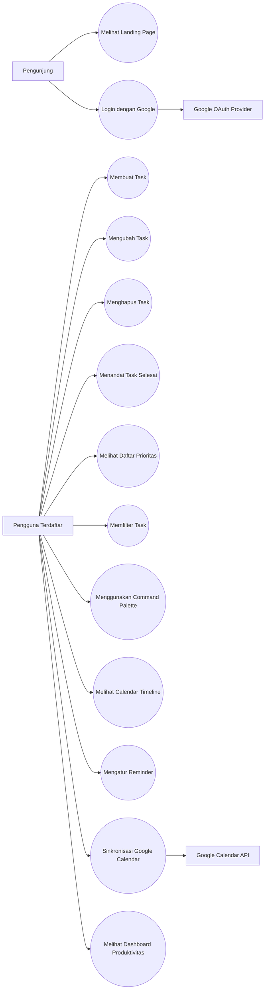

---

### 3.2 Context Diagram

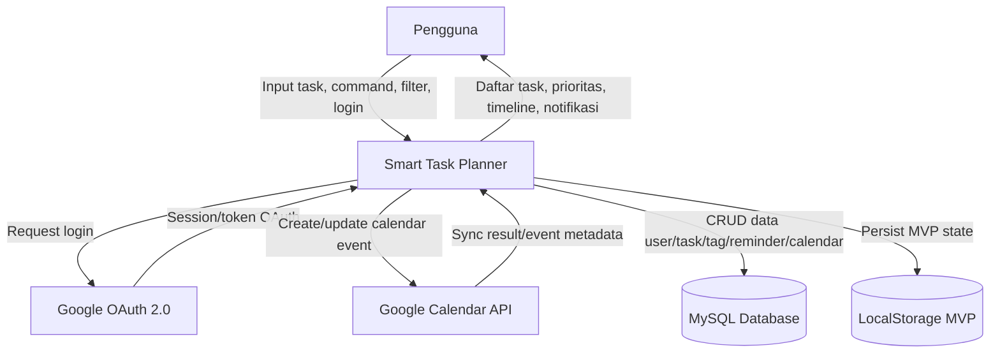

---

### 3.3 Component Diagram

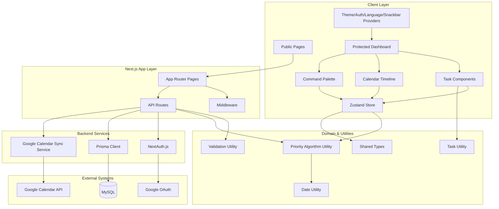

---

### 3.4 Data Flow Diagram Level 0

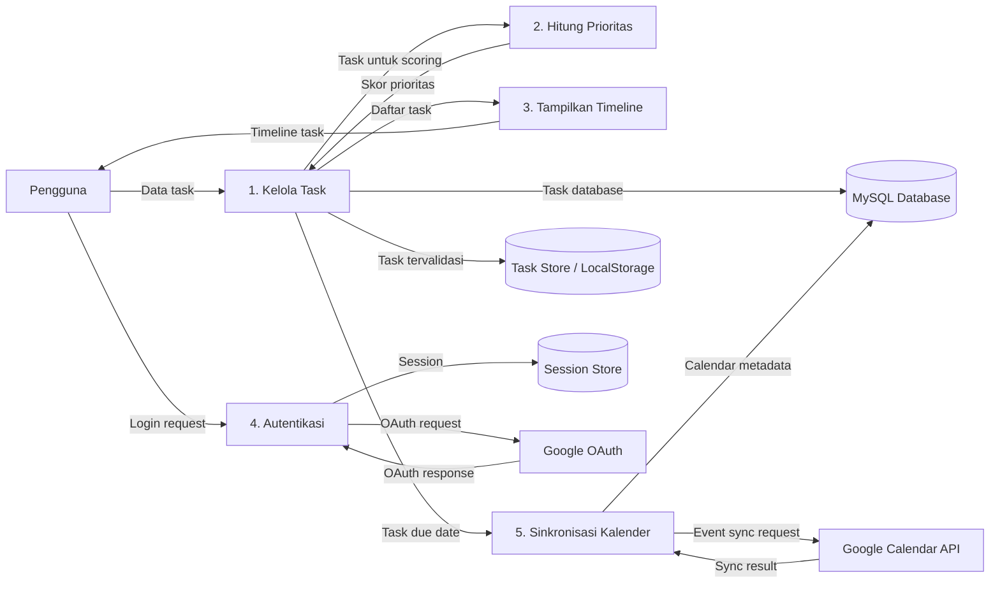

---

### 3.5 Entity Relationship Diagram

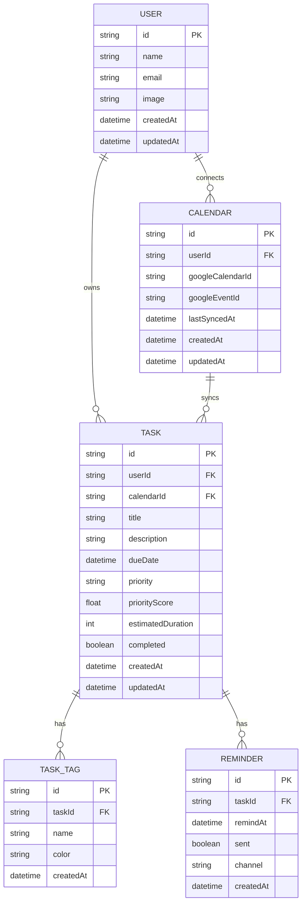

---

### 3.6 Sequence Diagram — Membuat Task dan Menghitung Prioritas

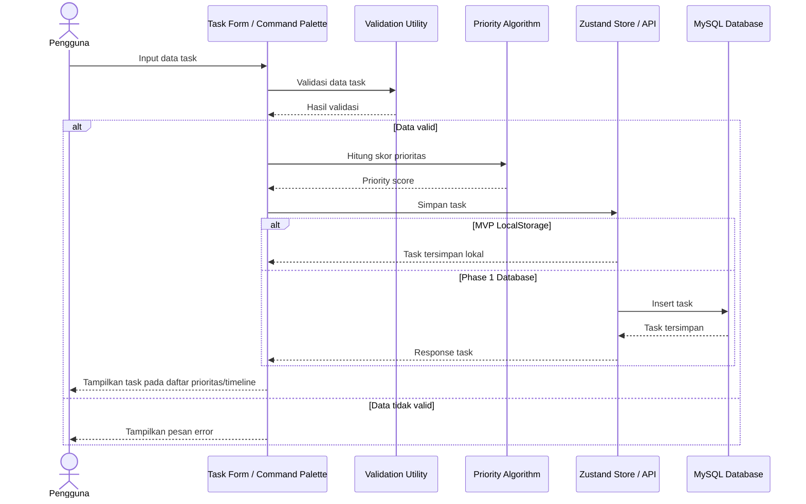

---

### 3.7 Sequence Diagram — Login dan Akses Dashboard

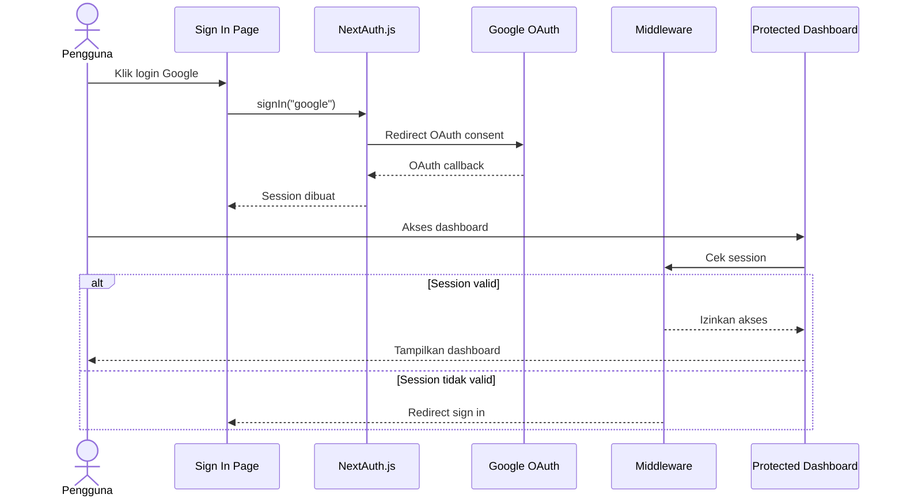

---

### 3.8 Sequence Diagram — Sinkronisasi Google Calendar

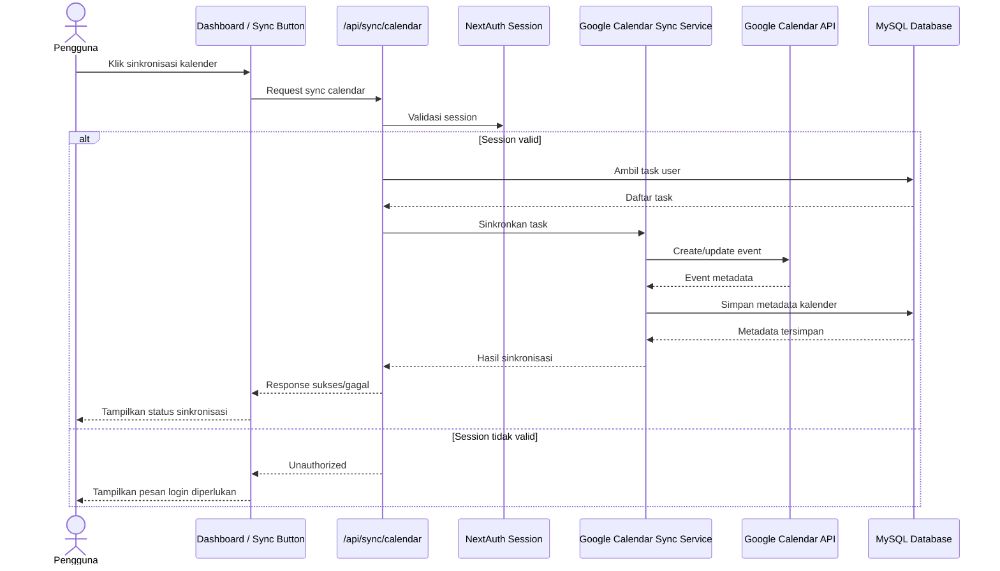

---

### 3.9 Activity Diagram — Pengelolaan Task

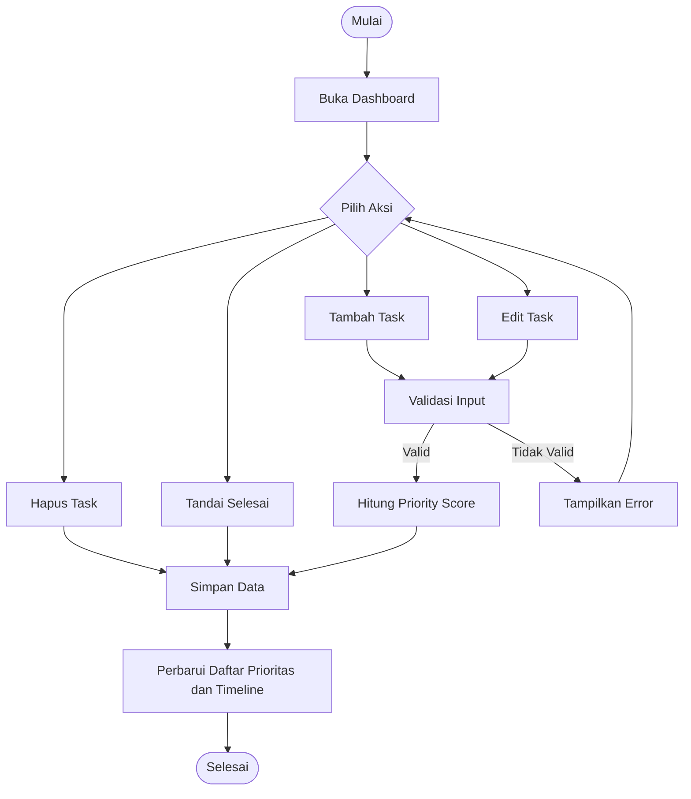

---

### 3.10 State Diagram — Status Task

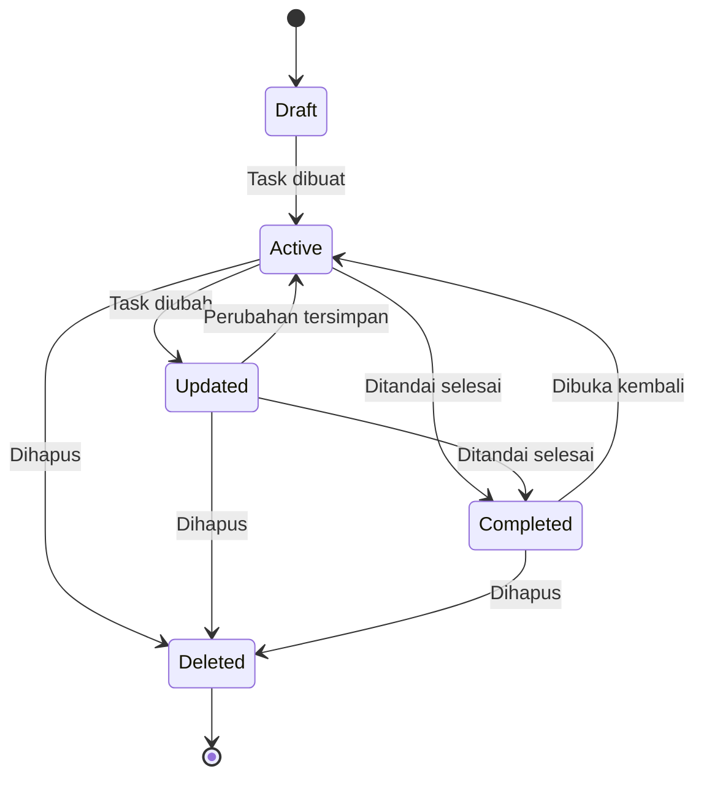

---

### 3.11 Lampiran Kode PlantUML untuk Draw.io

Selain diagram Mermaid di atas, bagian ini melampirkan kode PlantUML untuk setiap diagram agar dapat dibuat ulang di draw.io/diagrams.net melalui fitur PlantUML.

#### 3.11.1 PlantUML — Use Case Diagram

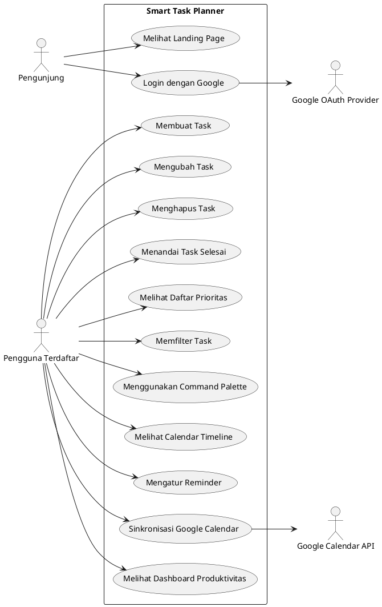

#### 3.11.2 PlantUML — Context Diagram

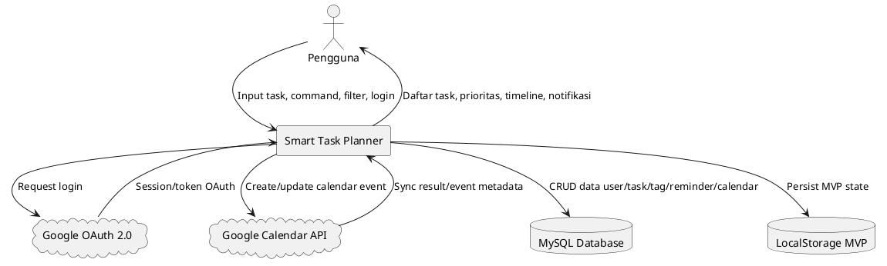

#### 3.11.3 PlantUML — Component Diagram

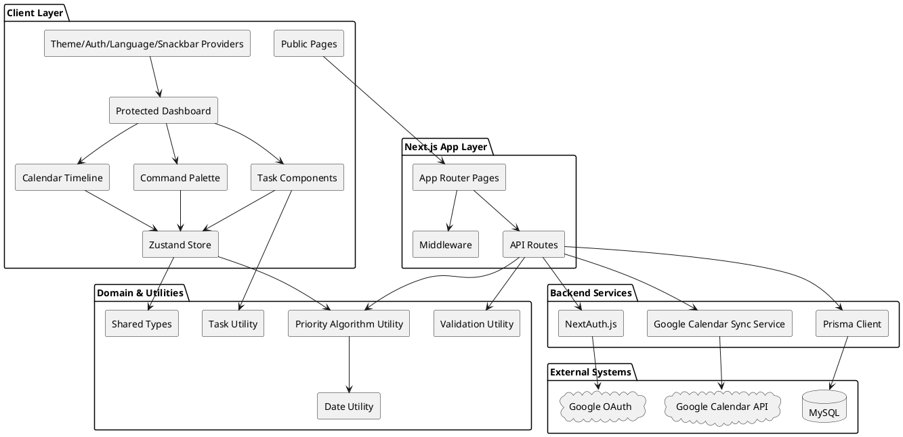

#### 3.11.4 PlantUML — Data Flow Diagram Level 0

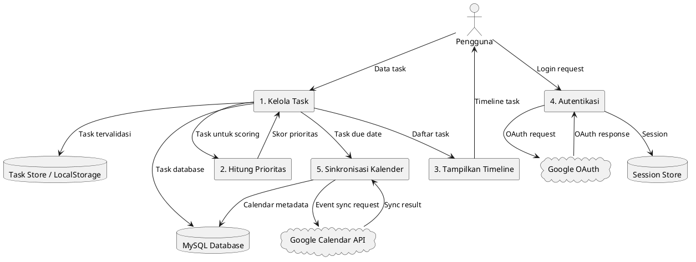

#### 3.11.5 PlantUML — Entity Relationship Diagram

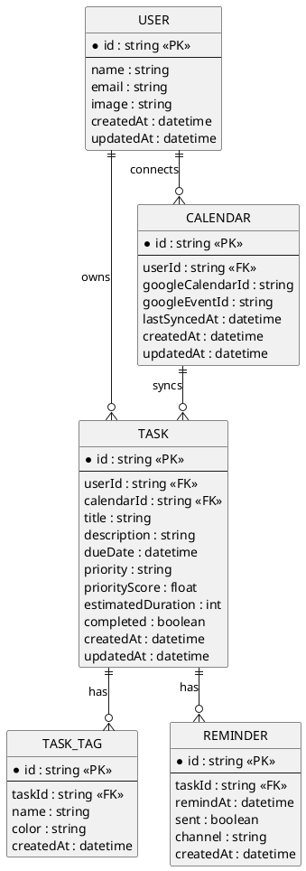

#### 3.11.6 PlantUML — Sequence Diagram Membuat Task dan Menghitung Prioritas

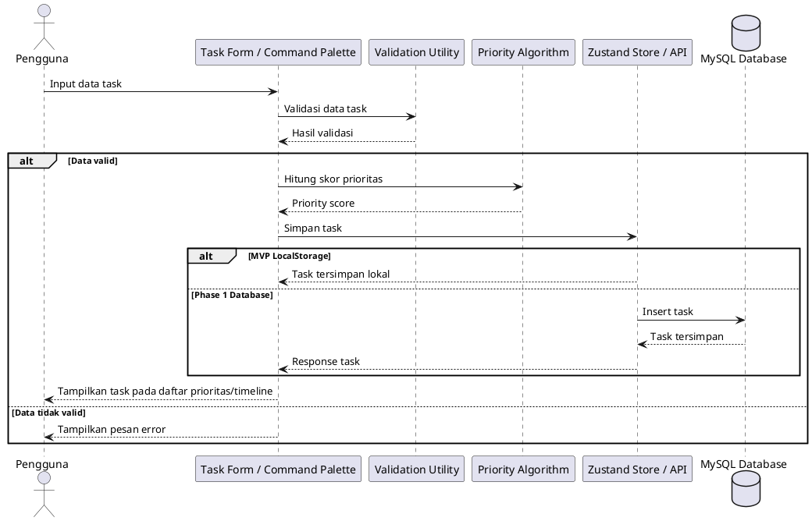

#### 3.11.7 PlantUML — Sequence Diagram Login dan Akses Dashboard

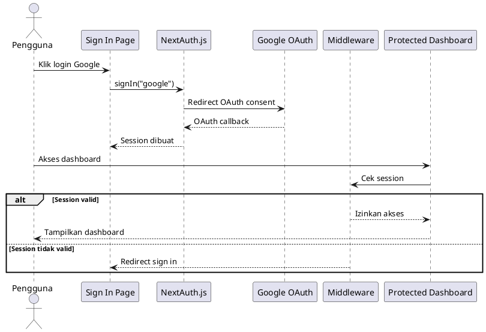

#### 3.11.8 PlantUML — Sequence Diagram Sinkronisasi Google Calendar

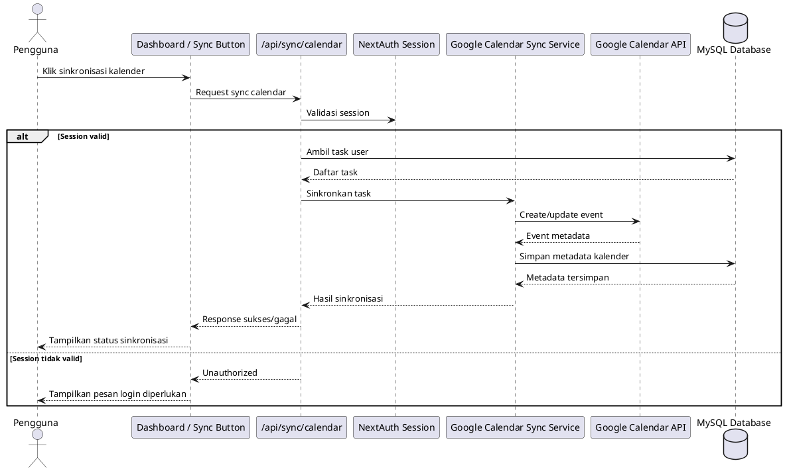

#### 3.11.9 PlantUML — Activity Diagram Pengelolaan Task

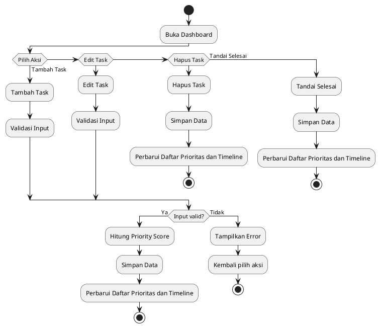

#### 3.11.10 PlantUML — State Diagram Status Task

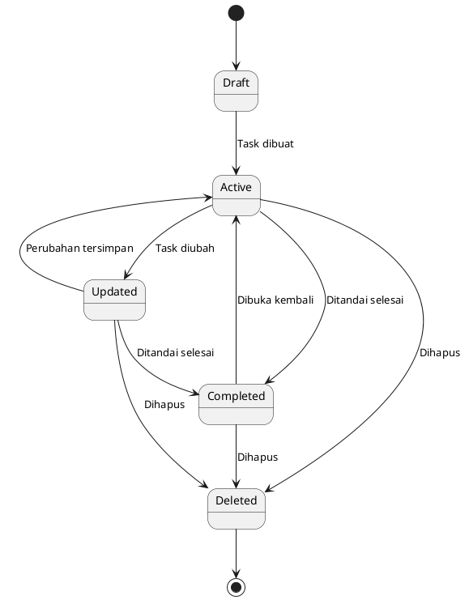

---

## 4. Catatan Progress Pengembangan

### 4.1 Progress MVP

| Area | Status |
|------|--------|
| Task CRUD lokal | Selesai |
| Priority algorithm | Selesai |
| Filtering task | Selesai |
| Calendar timeline | Selesai |
| Command palette | Selesai |
| NLP parsing dasar | Selesai |
| Dark/light mode | Selesai |
| LocalStorage persistence | Selesai |
| Responsive design | Selesai |

### 4.2 Progress Phase 1

| Area | Status |
|------|--------|
| Struktur API task | Dalam pengembangan |
| Prisma/MySQL | Dalam pengembangan |
| NextAuth.js Google OAuth | Dalam pengembangan |
| Google Calendar sync | Dalam pengembangan |
| Reminder dan notifikasi | Direncanakan |
| Proteksi route user | Dalam pengembangan |

### 4.3 Rekomendasi Tindak Lanjut

1. Finalisasi schema Prisma sesuai tabel `users`, `tasks`, `task_tags`, `reminders`, dan `calendars`.
2. Pastikan seluruh endpoint task memiliki validasi input dan session guard.
3. Tambahkan test untuk priority algorithm.
4. Tambahkan test untuk parser command palette.
5. Buat dokumentasi API endpoint.
6. Buat strategi migrasi data dari LocalStorage ke database user.
7. Validasi Google Calendar sync agar tidak membuat event duplikat.
8. Lengkapi dokumentasi deployment production.
9. Jalankan validasi:
   ```bash
   npm run lint
   npm run type-check
   npm run build
   ```

---

## 5. Kesimpulan

Smart Task Planner memiliki arah pengembangan yang jelas sebagai aplikasi task management cerdas berbasis web. MVP telah mencakup fitur utama seperti task CRUD, priority scoring, command palette, timeline, theme mode, dan LocalStorage persistence.

Pengembangan berikutnya berfokus pada penguatan aspek fullstack, yaitu autentikasi, database MySQL/Prisma, API CRUD, reminder, dan integrasi Google Calendar. Dokumen progress SKPL ini menjadi dasar untuk menyelaraskan kebutuhan fungsional, non-fungsional, serta model sistem agar pengembangan selanjutnya tetap konsisten dengan tujuan produk.