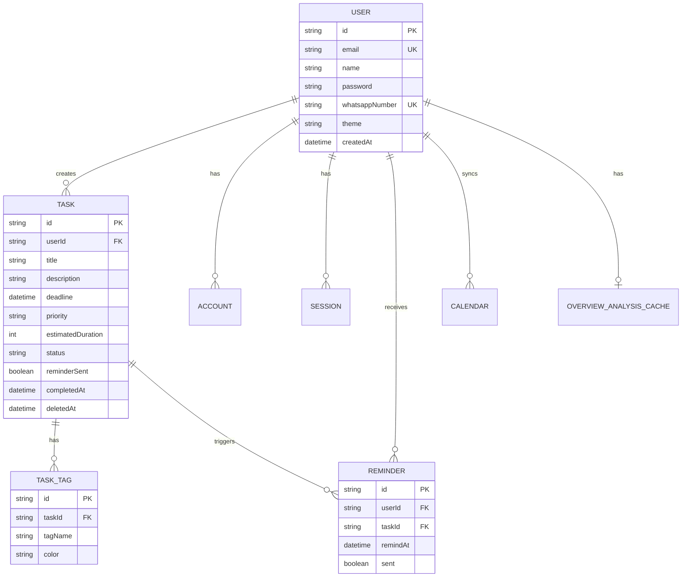

# Entity Relationship Diagram (ERD) - Mobile App

## Entity List

| Entity | Description |
|--------|-------------|
| **User** | User profile, credentials, and WhatsApp settings |
| **Task** | Core task entity with deadline, priority, and status |
| **TaskTag** | Category labels for tasks (1:N relationship with Task) |
| **Reminder** | Notification delivery log (daily or per-task) |
| **Calendar** | Google Calendar synchronization |
| **OverviewAnalysisCache** | AI analysis results cache for dashboard |

## ERD Diagram



## Data Dictionary

### Table: User

| Field | Type | Constraints | Description |
|-------|------|-------------|-------------|
| id | String (CUID) | PK | Primary Key |
| email | String | UK, NOT NULL | Unique email address |
| name | String | NOT NULL | Display name |
| password | String | NOT NULL | Hashed password (bcrypt) |
| whatsappNumber | String | UK, NULLABLE | WhatsApp for notifications |
| theme | String | DEFAULT 'light' | UI theme preference |
| createdAt | DateTime | NOT NULL | Account creation timestamp |

### Table: Task

| Field | Type | Constraints | Description |
|-------|------|-------------|-------------|
| id | String (CUID) | PK | Primary Key |
| userId | String | FK → User, NOT NULL | Task owner |
| title | String | NOT NULL | Task title |
| description | String | NULLABLE | Detailed description |
| deadline | DateTime | NOT NULL | Due date and time |
| priority | Enum | NOT NULL | HIGH, MEDIUM, LOW |
| estimatedDuration | Integer | DEFAULT 60 | Duration in minutes |
| difficulty | Enum | DEFAULT 'medium' | easy, medium, hard |
| status | Enum | NOT NULL | PENDING, DONE, SKIPPED |
| priorityScore | Float | NULLABLE | Calculated score (0-100) |
| reminderSent | Boolean | DEFAULT false | Notification sent flag |
| completedAt | DateTime | NULLABLE | Completion timestamp |
| deletedAt | DateTime | NULLABLE | Soft delete timestamp |
| createdAt | DateTime | NOT NULL | Creation timestamp |
| updatedAt | DateTime | NOT NULL | Last update timestamp |

### Table: TaskTag

| Field | Type | Constraints | Description |
|-------|------|-------------|-------------|
| id | String (CUID) | PK | Primary Key |
| taskId | String | FK → Task, NOT NULL | Parent task |
| tagName | String | NOT NULL | Tag label |
| color | String | NULLABLE | Tag color (hex) |

### Table: Reminder

| Field | Type | Constraints | Description |
|-------|------|-------------|-------------|
| id | String (CUID) | PK | Primary Key |
| userId | String | FK → User, NOT NULL | Target user |
| taskId | String | FK → Task, NULLABLE | Related task (if per-task) |
| remindAt | DateTime | NOT NULL | When to remind |
| sent | Boolean | DEFAULT false | Delivery status |
| type | Enum | NOT NULL | DAILY, PER_TASK, DEADLINE |

## Relationships Summary

```
┌─────────┐     ┌─────────┐     ┌───────────┐
│   User  │────▶│  Task   │────▶│ TaskTag    │
└─────────┘     └─────────┘     └───────────┘
     │               │
     │               ▼
     │          ┌──────────┐
     └─────────▶│ Reminder │
                 └──────────┘
```

## Mobile-Specific Considerations

### Local Storage Schema (AsyncStorage)

| Key | Type | Description |
|-----|------|-------------|
| `@auth_token` | String | JWT token for API auth |
| `@user_profile` | JSON | Cached user data |
| `@last_tasks_sync` | DateTime | Last successful sync |
| `@pending_actions` | Array | Offline action queue |

### React Query Cache Keys

| Key Pattern | Data Type | TTL |
|-------------|-----------|-----|
| `["tasks"]` | Task[] | 5 min |
| `["taskStats"]` | TaskStats | 2 min |
| `["dailyStats"]` | DailyStat[] | 10 min |
| `["weeklyStats"]` | WeeklyStat[] | 30 min |
