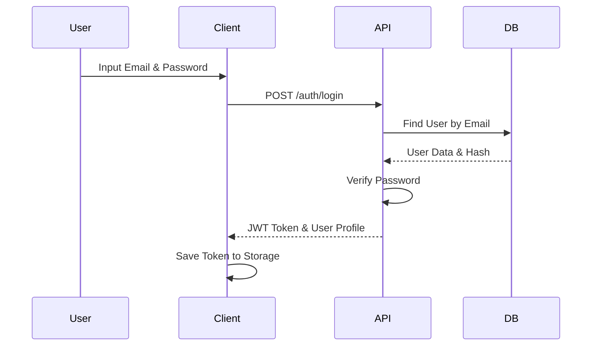
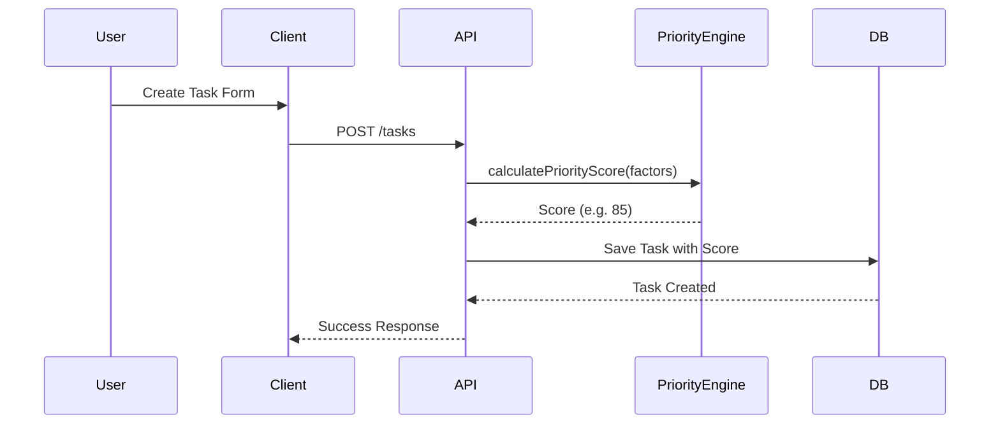
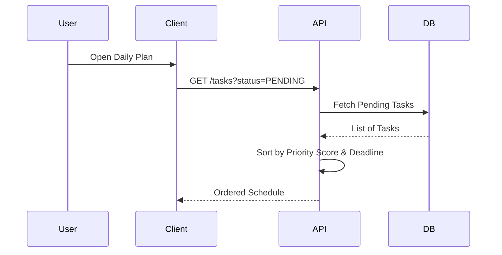
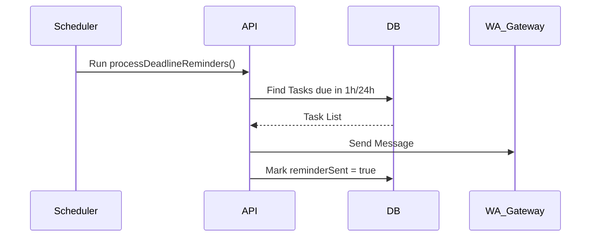

# System Architecture: Smart Task Planner

## High Level Architecture

```txt
[ Mobile App (Expo) ]    [ Web App (Next.js) ]
          │                       │
          └───────────┬───────────┘
                      ▼
              [ Nginx Reverse Proxy ]
                      │
              [ Express.js Backend ]
                      │
          ┌───────────┴───────────┐
          ▼                       ▼
    [ MySQL DB ]          [ 9Router AI Proxy ]
          │                       │
          └───────────────────────┘
```

## Sequence Diagrams

### 1. Authentication (Login)


### 2. Create Task & Priority Calculation


### 3. Daily Schedule Generation


### 4. Notification Trigger (WhatsApp/Local)

