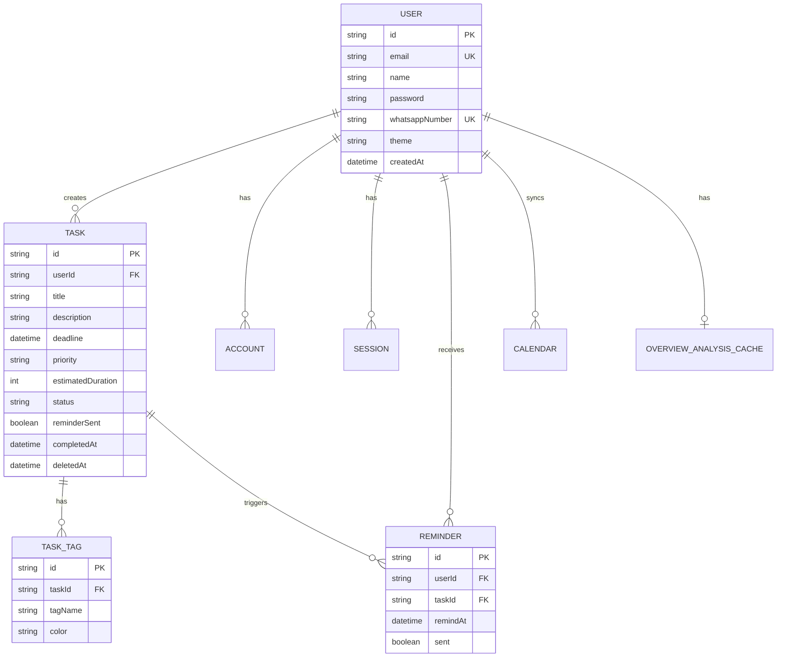

# Entity Relationship Diagram (ERD)

## Entity List

*   **User**: Menyimpan informasi profil pengguna, kredensial, dan pengaturan WhatsApp.
*   **Task**: Entitas utama tugas dengan deadline, prioritas, dan status.
*   **TaskTag**: Label kategori untuk tugas (1:N dengan Task).
*   **Reminder**: Log pengiriman notifikasi (harian atau per tugas).
*   **Calendar**: Sinkronisasi dengan Google Calendar.
*   **OverviewAnalysisCache**: Cache hasil analisis AI untuk dashboard.

## ERD Diagram

## Data Dictionary (Core Tables)

### Table: User
| Field | Type | Description |
| --- | --- | --- |
| id | String (CUID) | Primary Key |
| email | String | Unique Email |
| whatsappNumber | String | For WA Notifications |
| password | String | Hashed Password |

### Table: Task
| Field | Type | Description |
| --- | --- | --- |
| id | String (CUID) | Primary Key |
| userId | String | Foreign Key to User |
| title | String | Task Title |
| deadline | DateTime | Due Date |
| priority | String | HIGH, MEDIUM, LOW |
| status | String | TODO, IN_PROGRESS, DONE, SKIPPED |
| deletedAt | DateTime | For Soft Delete |
